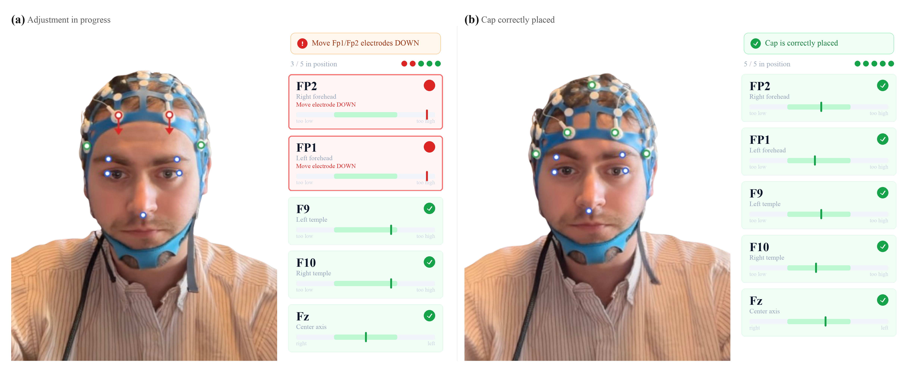
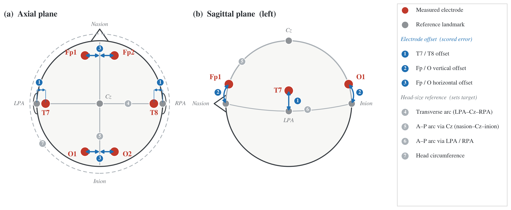
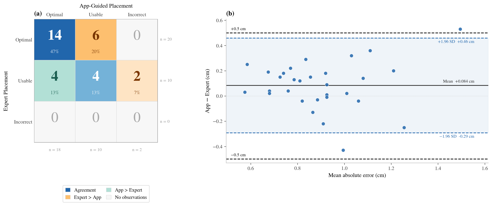
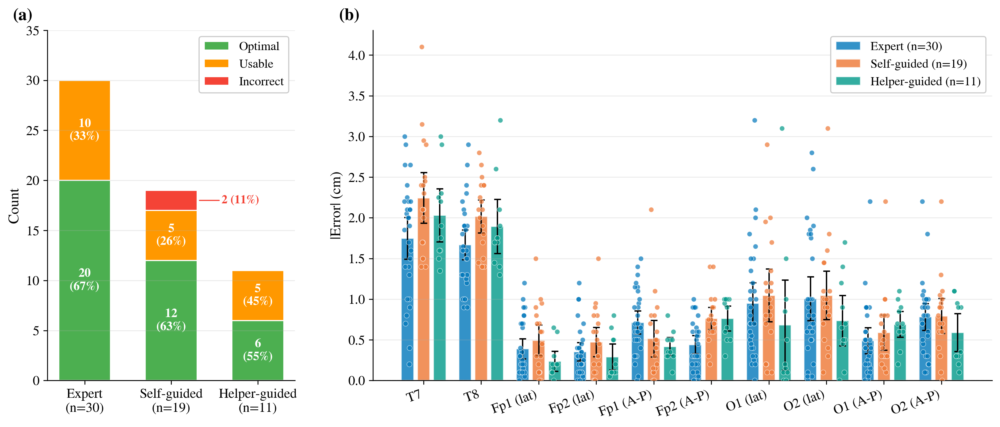

# AI-enabled quality assurance for point-of-care EEG cap positioning

Reproduction code and data for:

> Lehn-Schiøler W, Sverker Nilsson M, Armand Larsen S, Justesen AB,
> Skafte Detlefsen N, Beniczky S. *AI-enabled quality assurance for
> point-of-care EEG cap positioning by inexperienced users.*

Everything needed to reproduce the published results, from the de-identified
trial data through to the figures as they appear in the manuscript.

## The study in one paragraph

Thirty-one adults were enrolled in a randomised cross-over trial; thirty had
complete data. Each participant had an EEG cap placed twice: once by a
**certified EEG expert**, and once by an **inexperienced user following the
app's real-time visual guidance** — either the participant themselves
(self-guided, n = 19) or an untrained helper (helper-guided, n = 11). An expert
rater, blinded to placement condition, then measured the position of six
electrodes against their IFCN-derived expected positions and rated each
placement Optimal, Usable or Incorrect.



What the inexperienced arm was working from. Through the device camera the app
tracks the user's facial landmarks together with the cap's five front-facing
electrodes, and reports for each one whether it sits where the 10–20 system
puts it: **(a)** during adjustment, with Fp1 and Fp2 flagged too high, and
**(b)** the same cap once every position is in range. This is Figure 1 of the
paper, a composite of screen captures — the one image here that no script in
this repository regenerates.

## What is here

| Directory | Reproduces |
|---|---|
| [`study/`](study/) | Every number, table and figure in the paper, from the de-identified trial data. |
| [`forward_model/`](forward_model/) | The volume-conduction study supporting the 0.5 cm non-inferiority margin, on the public `fsaverage` template head. |

```
study/
  data/                 4 CSVs — the entire published dataset (52 KB)
    export_public_dataset.py   the allowlist exporter that produced them,
                               published for audit; it will not run here
  analyze_study.py      summary statistics, both pre-specified analyses, figures 01-16
  revision_analyses.py  per-electrode MAE, demographics, failure cases
  paper_figures.py      the 300 dpi manuscript composites
  outputs/              committed: exactly what the paper used
forward_model/
  geometry.py forward.py metrics.py dipole_fit.py   the BEM pipeline
  report.py             supplementary figure + headline numbers
  cache/                committed: the small summaries report.py needs
  figures/              committed: the supplementary figure
figures/                Figure 1 and Supplementary Material 2 — the two drawn
                        images, not generated from the data
```

## Quick start

```bash
uv sync   # exact environment from uv.lock; or:
          # pip install "pandas>=2.2" "numpy>=1.26" "scipy>=1.13" \
          #             "matplotlib>=3.8" "seaborn>=0.13" "mne>=1.7"

cd study
python analyze_study.py      # ~8 s  — statistics + figures 01-16
python revision_analyses.py  # ~2 s  — revision analyses -> outputs/part2-analyses.md
python paper_figures.py      # ~6 s  — the manuscript composites at 300 dpi
```

Those three scripts read only the CSVs in [`study/data/`](study/data/) and
write to `study/outputs/`. No network access, no credentials, no
configuration, under twenty seconds start to finish.

The forward model has heavier dependencies and downloads MNE's `fsaverage`
template on first run, but its cached summaries are committed, so
`cd forward_model && python report.py` regenerates the supplementary figure and
reprints every headline number in about two seconds. See
[`forward_model/README.md`](forward_model/README.md) to rebuild the full chain.

---

## What was measured



Six electrodes in red — Fp1, Fp2, T7, T8, O1, O2 — scored on three kinds of
offset (blue, ①–③): the temporal pair on their distance from the preauricular
point, and each frontopolar and occipital electrode on both a vertical and a
horizontal offset. Ten signed deviations per placement, in centimetres,
measured minus the position the 10–20 system prescribes.

Supplementary Material 2 of the paper, drawn by
[`figures/generate_measurement_schematic.py`](figures/generate_measurement_schematic.py).
It renders the protocol rather than the data, so it takes no inputs. The
committed PNG is the file submitted to the journal; re-running the script
reproduces it pixel for pixel but not byte for byte, since the PNG stream
depends on the matplotlib and font versions in use.

What it prescribes depends on the head, so four reference measurements (grey,
④–⑦) set each participant's own targets. Two of them, the transverse arc and
the A–P arc via Cz, are published in
[`reference_arcs.csv`](study/data/reference_arcs.csv) and carry the
normalisation and the head-size covariate.

Everything downstream is built from those ten numbers per trial. This is
Supplementary Material 2 of the paper; like Figure 1 it is a drawn schematic
rather than a plot of the data.

## Main result — Figure 2



**(a)** Blinded outcome ratings, expert against app-guided, for the 30 paired
participants. Both arms produced a clinically usable cap in the large majority
of placements; the two Incorrect ratings both fall in the app-guided arm, and
both came from self-placement. Marginal distributions do not differ
(Stuart–Maxwell Q = 2.400, p = 0.301), and category-level agreement is fair
(linearly weighted κ = 0.250).

**(b)** Per-participant mean absolute error. App-guided placement averaged
**0.084 cm worse** than expert placement, with 95 % limits of agreement of
**−0.29 to +0.46 cm** — the whole interval sits inside the pre-specified
±0.5 cm margin.

The paired difference in mean absolute error is statistically detectable across
all ten measurements (expert 0.855 cm vs app-guided 0.938 cm; Wilcoxon
W = 117.0, p = 0.018), and almost all of it sits in the temporal pair: T7 and T8
account for 86 % of the 0.084 cm pooled difference, and with the two excluded
the arms are indistinguishable (0.641 vs 0.655 cm, W = 208.5, p = 0.622). Both
temporal electrodes are displaced outward in every one of the 60 trials in both
arms — a deviation that never changes sign across 60 placements by different
operators points at a fixed geometric offset in the cap rather than at variable
user error. The offset is nonetheless larger under app-guided placement
(T7 +0.42 cm, p = 0.003; T8 +0.30 cm, p = 0.019), so it is not purely a property
of the cap. `revision_analyses.py` reproduces the per-electrode breakdown.

## Three-arm breakdown — Supplementary Material 4



Resolving the app arm into its two sub-conditions. **(a)** Helper-guided
placement produced no Incorrect outcomes; both failures came from self-placement,
where the participant cannot see the posterior electrodes while adjusting them.
**(b)** Per-electrode mean absolute error with 95 % CIs and individual
participant points. The T7/T8 gap between arms is visible at a glance; the
frontal and occipital electrodes overlap across all three arms.

## Does the conclusion depend on the 0.5 cm margin? No

Non-inferiority is concluded when the upper bound of the two-sided 90 %
confidence interval for the paired difference falls below the margin, so the
conclusion is a function of that bound alone. The bound is **0.143 cm**
(Δ = 0.084 cm, 90 % CI 0.024–0.143, n = 30), which means the same conclusion
would have followed from any margin above 0.143 cm — including 0.15, 0.20 and
0.25 cm, each roughly 2–3× stricter than the one prespecified.

This is a restatement of the interval rather than a second test, and it does
not replace the prespecified margin. It does mean the result is not an
artefact of the margin chosen. `revision_analyses.py` prints the sensitivity
table as section 1 of `part2-analyses.md`, and `_verify` fails the run if the
interval moves.

### What the margin is not

The margin is on the **between-condition difference in population mean** MAE.
It is not an acceptance threshold for an individual placement, and arithmetic
of the form *expert mean + margin = worst acceptable placement* does not
follow from the test.

Two properties of the metric are worth stating plainly, because both are easy
to get wrong when reading these numbers:

- **MAE is not a Euclidean displacement.** It averages **ten one-dimensional
  coordinate deviations** across six electrodes — T7 and T8 contribute one
  axis each, Fp1/Fp2/O1/O2 two each (see `ABS_COLS`). The same value can arise
  from small distributed deviations or from one large focal deviation, and for
  a two-axis electrode mean(|ap|, |lat|) ≤ √(ap² + lat²), so MAE systematically
  *understates* physical displacement.
- **MAE does not order placements by clinical acceptability.** In this study
  the blinded ratings overlap almost completely — Optimal 0.46–1.31 cm, Usable
  0.65–1.38 cm, Incorrect 1.29–1.76 cm. One App-guided placement at **1.29 cm
  was rated incorrect** (its deviations were spatially concentrated) while
  another at **1.31 cm was rated optimal**, and an **expert** placement at
  **1.38 cm** was rated usable.

## Forward model — exploratory, not reported in the paper


`forward_model/` contains a 3-layer BEM forward solution on the `fsaverage`
template head, comparing the nominal 19-electrode 10–20 array against displaced
arrays over 20 484 cortical dipoles. It was built to give mechanistic content
to the volume-conduction argument behind the 0.5 cm margin.

**It is retained here as exploratory work and is deliberately not used to
justify the margin.** The reason is the mismatch described above: the model
perturbs the array by a *uniform rigid displacement* and reports mean Euclidean
electrode movement, whereas the study's MAE is a mean of ten scalar coordinate
deviations over six electrodes. Mapping one onto the other would require
assumptions the data do not supply, and a single MAE value corresponds to many
different spatial patterns with different signal consequences. Reading the
curves as though a given MAE implied a given physical shift would therefore
overstate what the model can support.

What the model does show, on its own terms, is a dose–response: scalp
potential, interhemispheric asymmetry and dipole-fit localisation error all
vary linearly with array displacement over 0.18–1.46 cm (R² = 1.00), and an
isolated single-electrode displacement perturbs the signal far less than a
whole-cap shift of the same magnitude. That is a statement about the template
head model, not about clinical interpretation, and not about this cohort.

See [`forward_model/README.md`](forward_model/README.md) for the method, the
caching design and the full limitations.

## Everything else

`analyze_study.py` also writes 16 exploratory figures to `study/outputs/` —
signed-deviation distributions, per-participant heatmaps, and breakdowns by
sex, age, hair characteristics and trial order. `revision_analyses.py` writes
[`study/outputs/part2-analyses.md`](study/outputs/part2-analyses.md), the
prose report covering the non-inferiority margin sensitivity, the Table 1
participant characteristics, per-electrode MAE by arm, characteristics against
positioning accuracy, and both failure cases, plus the figure the
characteristics section embeds.

Two notes for anyone comparing against the submitted manuscript. Its Table 1
reports head circumference as 57.1 ± 2.1 cm (53–62); recomputed here from the
measurement workbook it is **57.1 ± 1.8 cm (54–62)** — the mean agrees exactly,
the spread does not, and the regenerated table uses the recomputed figures.
And circumference was added to the protocol after the first two participants, so
28 of the 30 have one. The preauricular and nasion–inion arcs, which are what
the expected electrode positions are derived from (10 % of each), are complete
and are now reported alongside it.

---

## Verifying a reproduction

`study/outputs/` and `forward_model/figures/` are committed, holding exactly
the files the manuscript used. The scripts overwrite them in place, so

```bash
git diff --stat
```

after a run is the reproduction check: an empty diff means byte-identical
output.

For that to be a real check the rendering environment has to match, so
`uv.lock` is committed and `pyproject.toml` pins dependency resolution to a
fixed cut-off date via `exclude-newer`. `uv sync` therefore rebuilds the exact
environment the committed figures came from (matplotlib 3.10.7, pandas 2.3.3,
mne 1.10.2) and every PNG comes back byte-identical, the forward-model figure
included.

Running on a newer stack is fine and is worth doing — every statistic here has
been checked against pandas 3.0.5 / numpy 2.5.2 / matplotlib 3.11.1 and is
unchanged to the last printed digit. Only the pixels move. Drop the
`exclude-newer` line, and compare the console output and `part2-analyses.md`
rather than the PNG bytes.

The two clinical code paths are deliberately independent: `paper_figures.py`
loads and reduces the data without importing `analyze_study.py`, so the
manuscript figures and the reported statistics reach the same numbers twice
over. A mistake in either shows up as a disagreement rather than as a
consistent error.

## Data provenance

The CSVs in `study/data/` are generated from the study's source workbooks by
an allowlist exporter that emits only the columns the published analysis
consumes. That exporter is published alongside its output, as
[`study/data/export_public_dataset.py`](study/data/export_public_dataset.py),
so the de-identification can be read and checked rather than taken on trust. It
refuses to run from this repository — it executes inside the study's private
analysis package, against workbooks that are not distributed.

The source workbooks are not published: alongside the pseudonymised
measurements they carry a participant name lookup, and scrubbing a spreadsheet
is a denylist — workbooks can hide data in additional sheets, cell comments,
defined names and cached pivot ranges. Exporting only named columns removes
that class of risk entirely.

The exported CSVs reproduce the analysis **bit-exactly** against the source
workbooks. One caveat is baked into the loader: `pandas.read_csv` must be given
`float_precision="round_trip"`, because its default float parser is fast but
not correctly rounded, and the last-bit error is enough to flip a tie in the
Wilcoxon sensitivity analysis.

See [`study/data/DATA_DICTIONARY.md`](study/data/DATA_DICTIONARY.md) for
the column-by-column description.

## Ethics

Data collection was conducted under DTU Compute Institutional Review Board
approval COMP-IRB-2026-01, in accordance with the Declaration of Helsinki, with
written informed consent obtained from all participants.

## Licence and citation

Code is MIT, the dataset is CC-BY-4.0; see [LICENSE](LICENSE). To cite, see
[CITATION.cff](CITATION.cff).

Nothing here depends on the guidance application or on its detector, so the
repository carries no copyleft obligation of its own. The application source
code, the trained detector weights and the detector's training images are not
part of this repository and are not released — the first two are proprietary
and under a pending patent, the third consists of identifiable facial
recordings that cannot be published under the consent obtained.

### Frozen release

The version accompanying the manuscript is tagged **v1.0.0** and archived with
a permanent DOI. Cite that DOI rather than the branch: `main` continues to
move. Zenodo metadata for the archive lives in [`.zenodo.json`](.zenodo.json);
the DOI is recorded in [`CITATION.cff`](CITATION.cff) once minted.
