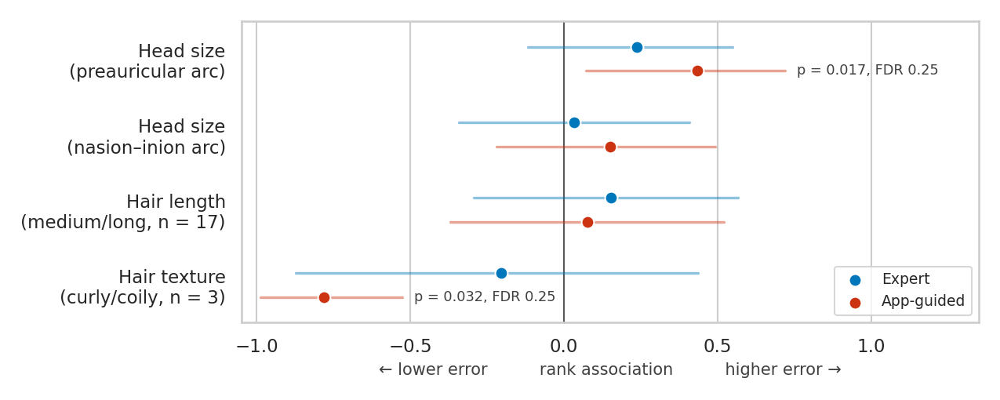

# Part 2 analyses — per-electrode errors, participant characteristics,
# and the two incorrect placements

Generated by `clinical/revision_analyses.py`, which reuses the
parsing and subject-exclusion rules of `analyze_study.py` and verifies
that it still reproduces the manuscript's headline numbers before
computing anything new.

n = 30 participants, 60 trials.

## 1. Per-electrode error by arm (Reviewer 2, point 7)

Mean absolute error (cm) per measured position. *Signed* columns give
the mean directional deviation (measured − expected); a positive value
means placement too far from the reference landmark. The Wilcoxon test
is paired within participant and is exploratory — the study was not
powered for per-electrode comparisons.

| Electrode | Expert MAE | App MAE | Δ | p | Expert signed | App signed |
|---|---|---|---|---|---|---|
| T7 | 1.75 ± 0.72 | 2.17 ± 0.64 | +0.42 | 0.003 | +1.75 | +2.17 |
| T8 | 1.67 ± 0.52 | 1.97 ± 0.49 | +0.30 | 0.019 | +1.67 | +1.97 |
| Fp1 (lat) | 0.39 ± 0.34 | 0.40 ± 0.37 | +0.01 | 0.750 | -0.04 | +0.08 |
| Fp2 (lat) | 0.35 ± 0.31 | 0.41 ± 0.37 | +0.05 | 0.501 | +0.01 | +0.09 |
| Fp1 (A-P) | 0.72 ± 0.39 | 0.48 ± 0.41 | -0.24 | 0.014 | -0.72 | -0.36 |
| Fp2 (A-P) | 0.44 ± 0.31 | 0.76 ± 0.28 | +0.32 | < 0.001 | -0.43 | -0.72 |
| O1 (lat) | 0.95 ± 0.71 | 0.91 ± 0.81 | -0.04 | 0.946 | +0.86 | +0.85 |
| O2 (lat) | 1.00 ± 0.75 | 0.93 ± 0.63 | -0.07 | 0.603 | +0.72 | +0.87 |
| O1 (A-P) | 0.49 ± 0.45 | 0.63 ± 0.41 | +0.13 | 0.089 | -0.44 | -0.56 |
| O2 (A-P) | 0.78 ± 0.46 | 0.72 ± 0.45 | -0.06 | 0.469 | -0.78 | -0.68 |

Pooled across all ten positions: Expert 0.855 cm, App-guided 0.938 cm.

**T7 and T8 account for 86% of the overall difference between arms** (+0.072 cm of +0.084 cm). Both electrodes are displaced outward in *every one of the 60 trials*, in both arms (T7 minimum +0.20 cm, T8 minimum +0.90 cm): not one placement, expert or guided, put either temporal electrode short of its reference position. A deviation that never changes sign across 60 independent placements by different operators is the signature of a fixed geometric offset in the cap, not of variable user error.

Two qualifications the manuscript should carry. First, although the temporal bias is present in both arms, it is significantly *larger* under App-guided placement (T7 +0.42 cm, p = 0.003; T8 +0.30 cm, p = 0.019), so it is not purely a cap-geometry effect independent of who placed the cap. Second, the arms differ in opposite directions at the two frontal anteroposterior positions — App-guided is better at Fp1 and worse at Fp2 — which is difficult to attribute to a systematic cause and is most likely noise at this sample size.

## 2. Participant characteristics vs. positioning accuracy
   (Reviewer 1, minor comment 1)

Outcome is per-participant mean absolute error across all ten
positions. Exploratory: p-values are unadjusted, with
Benjamini–Hochberg values alongside. Head circumference was not
recorded in the study database, so the preauricular and nasion–inion
arcs — the measurements from which expected electrode positions were
derived — are used as head-size covariates.

| Arm | Characteristic | Test | n | Effect | p | p (FDR) |
|---|---|---|---|---|---|---|
| Expert | Age (years) | Spearman | 30 | rho = -0.20 | 0.283 | 0.838 |
| Expert | Preauricular arc (cm) | Spearman | 30 | rho = +0.24 | 0.208 | 0.838 |
| Expert | Nasion–inion arc (cm) | Spearman | 30 | rho = +0.03 | 0.863 | 0.875 |
| Expert | Sex | Mann–Whitney | 30 | Female 0.88 vs Male 0.81 cm | 0.628 | 0.838 |
| Expert | Hair texture | Mann–Whitney | 29 | Curly/Coily 0.82 vs Straight/Wavy 0.86 cm | 0.591 | 0.838 |
| Expert | Hair density | Mann–Whitney | 30 | High Density 0.90 vs Thin/Average 0.83 cm | 0.385 | 0.838 |
| Expert | Strand diameter | Mann–Whitney | 29 | Coarse 0.89 vs Fine/Medium 0.84 cm | 0.345 | 0.838 |
| Expert | Hair length | Mann–Whitney | 30 | Medium/Long 0.89 vs Short/Shaved 0.81 cm | 0.490 | 0.838 |
| Expert | Structural styling | not tested | 29 | group too small (min n = 1) | — | — |
| App-guided | Age (years) | Spearman | 30 | rho = -0.06 | 0.740 | 0.846 |
| App-guided | Preauricular arc (cm) | Spearman | 30 | rho = +0.43 | 0.017 | 0.253 |
| App-guided | Nasion–inion arc (cm) | Spearman | 30 | rho = +0.15 | 0.428 | 0.838 |
| App-guided | Sex | Mann–Whitney | 30 | Female 0.93 vs Male 0.96 cm | 0.538 | 0.838 |
| App-guided | Hair texture | Mann–Whitney | 29 | Curly/Coily 0.75 vs Straight/Wavy 0.96 cm | 0.032 | 0.253 |
| App-guided | Hair density | Mann–Whitney | 30 | High Density 0.90 vs Thin/Average 0.96 cm | 0.433 | 0.838 |
| App-guided | Strand diameter | Mann–Whitney | 29 | Coarse 0.93 vs Fine/Medium 0.96 cm | 0.875 | 0.875 |
| App-guided | Hair length | Mann–Whitney | 30 | Medium/Long 0.96 vs Short/Shaved 0.91 cm | 0.738 | 0.846 |
| App-guided | Structural styling | not tested | 29 | group too small (min n = 1) | — | — |



*Figure S1. The reviewer's two hypotheses — head size and hair —
against per-participant mean absolute positioning error, by arm.
Points are rank associations on a common scale (Spearman's ρ for the
arcs, rank-biserial r for the named hair group); positive means higher
error, and bars are 95% percentile bootstrap intervals. Two
associations separate from zero, both in the App-guided arm, and
neither survives Benjamini–Hochberg correction; the curly/coily
contrast rests on three participants. The remaining characteristics
are in the table above and are null in both arms.*

**No characteristic survives correction for multiple comparisons.**
Two associations reach nominal significance before correction, both in
the App-guided arm and both worth reporting honestly rather than
suppressing:

- *Head size.* Positioning error rises with preauricular arc under
  App-guided placement (rho = +0.43, p = 0.017) but not under Expert
  placement (rho = +0.24, p = 0.21). This is the reviewer's hypothesis
  and it is the one signal pointing in the expected direction, but it
  does not survive correction (FDR p = 0.25) and the arm difference is
  itself untested.
- *Hair texture.* Curly/coily hair was associated with **lower** error
  (0.75 vs 0.96 cm, p = 0.032) — the opposite of the expected
  direction. This rests on three participants and should not be
  interpreted; it is reported only to avoid selective presentation.

Hair length, the reviewer's other hypothesis, shows no association in
either arm (App-guided p = 0.74). Structural styling could not be
tested: 28 of 29 participants with the field recorded wore hair loose.

The honest summary for the manuscript is that this cohort was neither
designed nor powered to detect demographic effects on placement
accuracy, that no effect survives correction, and that performance in
participants with dense curly or coily hair remains genuinely
uncertain on three participants.

## 3. The two incorrect placements (Reviewer 2, point 4)

Signed deviation (cm) per position for each trial rated Incorrect.

| Electrode | Subject 1 (Self-guided) | Subject 19 (Self-guided) |
|---|---|---|
| T7 | +1.40 | +4.10 |
| T8 | +1.40 | +2.80 |
| Fp1 (lat) | +1.50 | +0.10 |
| Fp2 (lat) | +1.50 | +0.20 |
| Fp1 (A-P) | -0.40 | -2.10 |
| Fp2 (A-P) | -0.80 | +0.60 |
| O1 (lat) | -0.70 | +2.90 |
| O2 (lat) | +0.80 | +3.10 |
| O1 (A-P) | -2.20 | -0.80 |
| O2 (A-P) | -2.20 | -0.90 |

Characteristics of the two participants:

```
 subject_id     method  mae  age    sex hair_texture_s hair_density_s hair_length_s  preauricular_arc  nasion_inion_arc
          1 Self + App 1.29   20   Male  Straight/Wavy   High Density  Short/Shaved              38.0              37.0
         19 Self + App 1.76   30 Female  Straight/Wavy   Thin/Average   Medium/Long              37.0              36.0
```

**Both failures occurred in the self-guided sub-condition** (2 of 19,
11%); there were none among the 11 helper-guided placements and none
among the 30 expert placements. That is the clearest common factor.

The two profiles are not alike, so a single mechanism is unlikely.
Subject 19 shows a large, coherent displacement — T7 +4.1 cm with both
occipital positions displaced laterally by roughly 3 cm — consistent
with the whole cap sitting rotated and offset on the head. Subject 1
shows a smaller, more diffuse pattern whose largest components are the
two occipital anteroposterior positions (both −2.2 cm), consistent with
the cap sitting too far forward rather than rotated. Both are
consistent with the ergonomic difficulty of self-placement, where the
participant cannot see the posterior electrodes while adjusting them.

> The application's own verdict at the time of placement was **not
> recorded** in the study database, so whether the app had indicated
> acceptable placement cannot be determined from these data. This is a
> limitation of the study design: a false-negative of the
> quality-assurance function is the failure mode that matters most, and
> it cannot be assessed retrospectively. Prospective logging of the
> application's own output should be a requirement for future studies.

