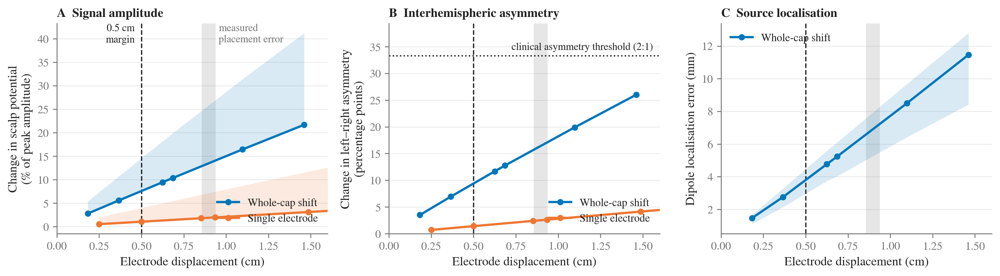

# Forward-model study: how much does a displaced electrode change the EEG?

Supports the **0.5 cm non-inferiority margin** in the clinical paper, which was
justified by an assertion about volume-conduction smoothing rather than a
demonstration; this module supplies the demonstration.

## The question

If an EEG electrode sits 0.5 cm away from where the 10–20 system says it should,
how much does the recorded signal actually change?

## Approach

A boundary-element forward solution on the **fsaverage template head** (3-layer
BEM: scalp / skull / brain, ico-5 cortical source space, 20 484 dipoles
constrained normal to the cortical surface). The leadfield is computed for the
nominal 19-electrode 10–20 array and for perturbed arrays, and the two are
compared over the whole cortical source population.

Two perturbation modes:

| Mode | What it represents |
|---|---|
| **Whole-cap shift** | The dominant real-world error. Because inter-electrode geometry inside a cap is fixed, a misplaced cap is a *rigid rotation* about the head centre, not independent per-electrode jitter. Electrodes near the rotation axis (T7/T8 for an anteroposterior slip) move less — which is physically correct. |
| **Single electrode** | One electrode displaced in 8 tangential directions, comparable to Wang & Gotman (2001). |

Displacements sweep 0.25–2.0 cm and include **0.855 cm** and **0.938 cm** — the
Expert and App-guided mean absolute errors measured in the clinical study — so
the margin can be read against the study's own empirical baseline.

## Metrics

- **Signal amplitude** — change in scalp potential as a fraction of that source's
  peak scalp amplitude.
- **Topography** — RDM (shape) and ln-magnitude, standard forward-comparison measures.
- **Interhemispheric asymmetry** — change in the left/right asymmetry index at
  homologous pairs, read against the ~33 pp that corresponds to a clinically
  called 2:1 asymmetry.
- **Source localisation** — continuous dipole fit: data generated through the
  *displaced* array, then localised assuming the array is where it should be.

## Result



Every metric is linear in displacement over the range that matters (R² = 1.00),
so the margin can be read straight off the curves. The dashed lines mark the
Expert error measured in this study (0.855 cm) and the least accurate
placement the margin would still accept (0.855 + 0.5 = 1.355 cm); the diamond
is the App-guided error actually observed (0.938 cm). This is Supplementary
Material 5 of the paper; run `python3 report.py` to reprint the headline
numbers behind the figure.

## Files

| File | Role |
|---|---|
| `geometry.py` | Scalp surface, 10–20 positions, rigid rotation and tangential displacement |
| `forward.py` | Single batched BEM forward solution over all distinct electrode positions |
| `metrics.py` | Amplitude / topography / asymmetry / grid-scan localisation |
| `dipole_fit.py` | Continuous dipole-fit localisation error (slow; cached) |
| `report.py` | Supplementary figure + headline numbers |

```bash
python3 forward.py      # ~3 min, writes cache/leadfield.npz (~58 MB)
python3 dipole_fit.py   # ~20 min, writes cache/dipole_fit.csv
python3 report.py       # writes figures/forward_displacement.png
```

`cache/summary.csv` and `cache/dipole_fit.csv` are committed, so `report.py`
alone regenerates the supplementary figure and reprints every headline number
in a couple of seconds. Only the 58 MB leadfield is left out of the repository;
run `forward.py` and `dipole_fit.py` to rebuild the whole chain from the
template head.

Requires `mne` (already in the repo `.venv`) and the fsaverage dataset, fetched
automatically to `~/mne_data/` on first run. No MRI, FreeSurfer or GPU needed.

## Design notes worth knowing before editing

- **One forward solution, many arrays.** BEM setup costs ~47 s but only ~0.05 s
  per extra electrode, so every distinct electrode position across all 312
  variants goes into a *single* montage (763 positions) and each variant's
  leadfield is recovered by row selection. This is valid only because MNE's EEG
  leadfield is **not** average-referenced — potentials are absolute, so rows are
  independent of which other electrodes share the montage.
  `forward._assert_unreferenced` checks this rather than assuming it; the average
  reference is applied per configuration in `metrics.py`.
- **Coordinate frames.** Geometry is built in fsaverage MRI (surface RAS) because
  that is the frame the BEM surfaces and `standard_1020` live in. But the source
  space stored *inside* a computed forward solution has been converted to **head**
  coordinates, and `Dipole.pos` is in head coordinates too — so those two compare
  directly, with no transform. Applying one anyway produces a ~51 mm constant
  offset with a perfect goodness-of-fit, which looks like a result and is not.
- **The grid scan understates small displacements.** `metrics.localisation_error_mm`
  scans the discrete ico-5 grid (~3.1 mm spacing), so sub-grid displacements
  recover the same vertex and report exactly 0 mm. That biases *towards* our own
  conclusion, so the paper uses the continuous fit in `dipole_fit.py`
  (floor ~0.1 mm, verified against undisplaced data) instead. The grid scan is
  retained only as a cross-check.
- **Abscissa differs by mode.** A cap shift moves all 19 electrodes, so the array
  mean is the right x-value; a single-electrode displacement moves one, so the
  mean would divide the true displacement by 19. See `report._curve`.
- **Weak sources are excluded.** Deep and medial-wall dipoles project almost
  nothing to the scalp, so relative error there is division by near-zero. Metrics
  keep the upper 50% of sources by scalp-projection strength.

## Limitations (must be stated in the paper)

Template anatomy, so no inter-individual variability in skull thickness or
conductivity; noise-free; dipolar sources; a fixed 19-electrode array. The study
bounds the *signal-level* consequence of a displacement. It does not establish
clinical-decision equivalence, and should be presented as supporting the
plausibility of the margin rather than proving that 0.5 cm is clinically
irrelevant.
