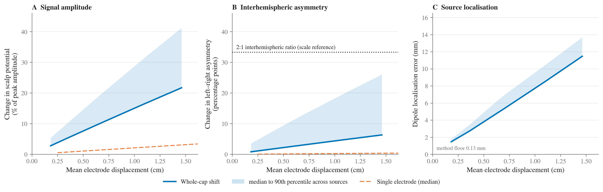

# Forward-model study: how much does a displaced electrode change the EEG?

> ### Supplementary Material 7 of the clinical paper
>
> Reported as exploratory mechanistic context for the volume-conduction
> argument behind the **0.5 cm non-inferiority margin** — not as a clinical
> validation of it, and not as a per-placement tolerance.
>
> **Read the abscissa carefully.** The model perturbs the array by a uniform
> rigid displacement. The study's mean absolute error is a different quantity:
> the mean of **ten one-dimensional coordinate deviations** across six
> electrodes (T7/T8 one axis each, Fp1/Fp2/O1/O2 two each). A single value of
> that measure is consistent with many spatial patterns — small distributed
> deviations, or one large focal one — which do not have the same signal
> consequences. The study's own data show it: a placement at 1.29 cm was rated
> clinically incorrect while one at 1.31 cm was rated optimal, and an expert
> placement at 1.38 cm was rated usable.
>
> So the margin span drawn on these curves locates the margin on the model's
> axis; it does not define a worst acceptable placement. The margin's
> robustness rests instead on the margin-sensitivity analysis in
> `study/revision_analyses.py` (section 1), which uses only the trial
> measurements: the conclusion holds for any margin above 0.143 cm.

## The question it was built to answer

If an EEG electrode sits 0.5 cm away from where the 10–20 system says it should,
how much does the recorded signal change *in this template head model*?

## Approach

A boundary-element forward solution on the **fsaverage template head** (3-layer
BEM: scalp / skull / brain, ico-5 cortical source space, 20 484 dipoles
constrained normal to the cortical surface). The leadfield is computed for the
nominal 19-electrode 10–20 array and for perturbed arrays, and the two are
compared over the whole cortical source population.

Two perturbation modes:

| Mode | What it represents |
|---|---|
| **Whole-cap shift** | The dominant real-world error. Because inter-electrode geometry inside a cap is fixed, a misplaced cap is a *rigid rotation* about the head centre, not independent per-electrode jitter. Electrodes near the rotation axis (T7/T8 for an anteroposterior slip) move less — which is physically correct. |
| **Single electrode** | One electrode displaced in 8 tangential directions, comparable to Wang & Gotman (2001). |

Displacements sweep 0.25–2.0 cm. The sweep includes 0.855 cm and 0.938 cm, the
Expert and App-guided mean absolute errors measured in the clinical study,
because those magnitudes were of interest when the module was written — but see
the note above: MAE and array displacement are not the same quantity, and the
curves should not be read at those abscissae as though they were.

## Metrics

- **Signal amplitude** — change in scalp potential as a fraction of that source's
  peak scalp amplitude.
- **Topography** — RDM (shape) and ln-magnitude, standard forward-comparison measures.
- **Interhemispheric asymmetry** — change in the left/right asymmetry index at
  homologous pairs. (For scale, a 2:1 interhemispheric ratio corresponds to
  ~33 pp on this index. That is a reference point for the magnitude of the
  index, not a safety threshold: a change below it does not imply that a
  displacement is clinically harmless, since it says nothing about spike-field
  morphology, phase reversal or local topography.)
- **Source localisation** — continuous dipole fit: data generated through the
  *displaced* array, then localised assuming the array is where it should be.

## Result



Every metric is linear in array displacement over the range studied
(R² = 1.00), and an isolated single-electrode displacement perturbs the signal
far less than a whole-cap shift of the same magnitude — at 1 cm, 2.1 % of peak
amplitude against 15.0 %.

The figure marks the study's Expert error (0.855 cm), the App-guided error
observed (0.938 cm, diamond) and the far end of the margin span (1.355 cm).
Those are positions on the model's displacement axis, carried over from the
study's own measure — see the note at the top for why the two are not the same
quantity and why the far end is not a worst acceptable placement. The dotted
line in panel B is a scale reference for the asymmetry index, not a threshold
of clinical acceptability.

Run `python3 report.py` to regenerate the figure and reprint the numbers.

## Files

| File | Role |
|---|---|
| `geometry.py` | Scalp surface, 10–20 positions, rigid rotation and tangential displacement |
| `forward.py` | Single batched BEM forward solution over all distinct electrode positions |
| `metrics.py` | Amplitude / topography / asymmetry / grid-scan localisation |
| `dipole_fit.py` | Continuous dipole-fit localisation error (slow; cached) |
| `report.py` | Supplementary figure + headline numbers |

```bash
python3 forward.py      # ~3 min, writes cache/leadfield.npz (~58 MB)
python3 dipole_fit.py   # ~20 min, writes cache/dipole_fit.csv
python3 report.py       # writes figures/forward_displacement.png
```

`cache/summary.csv` and `cache/dipole_fit.csv` are committed, so `report.py`
alone regenerates the supplementary figure and reprints every headline number
in a couple of seconds. Only the 58 MB leadfield is left out of the repository;
run `forward.py` and `dipole_fit.py` to rebuild the whole chain from the
template head.

Requires `mne` (already in the repo `.venv`) and the fsaverage dataset, fetched
automatically to `~/mne_data/` on first run. No MRI, FreeSurfer or GPU needed.

## Design notes worth knowing before editing

- **One forward solution, many arrays.** BEM setup costs ~47 s but only ~0.05 s
  per extra electrode, so every distinct electrode position across all 312
  variants goes into a *single* montage (763 positions) and each variant's
  leadfield is recovered by row selection. This is valid only because MNE's EEG
  leadfield is **not** average-referenced — potentials are absolute, so rows are
  independent of which other electrodes share the montage.
  `forward._assert_unreferenced` checks this rather than assuming it; the average
  reference is applied per configuration in `metrics.py`.
- **Coordinate frames.** Geometry is built in fsaverage MRI (surface RAS) because
  that is the frame the BEM surfaces and `standard_1020` live in. But the source
  space stored *inside* a computed forward solution has been converted to **head**
  coordinates, and `Dipole.pos` is in head coordinates too — so those two compare
  directly, with no transform. Applying one anyway produces a ~51 mm constant
  offset with a perfect goodness-of-fit, which looks like a result and is not.
- **The grid scan understates small displacements.** `metrics.localisation_error_mm`
  scans the discrete ico-5 grid (~3.1 mm spacing), so sub-grid displacements
  recover the same vertex and report exactly 0 mm. That biases *towards* our own
  conclusion, so the paper uses the continuous fit in `dipole_fit.py`
  (floor ~0.1 mm, verified against undisplaced data) instead. The grid scan is
  retained only as a cross-check.
- **Abscissa differs by mode.** A cap shift moves all 19 electrodes, so the array
  mean is the right x-value; a single-electrode displacement moves one, so the
  mean would divide the true displacement by 19. See `report._curve`.
- **Weak sources are excluded.** Deep and medial-wall dipoles project almost
  nothing to the scalp, so relative error there is division by near-zero. Metrics
  keep the upper 50% of sources by scalp-projection strength.

## Limitations

Template anatomy, so no inter-individual variability in skull thickness or
conductivity; noise-free; dipolar sources; a fixed 19-electrode array; and a
uniform rigid perturbation that does not correspond to the measurement
structure of the clinical study (see the note at the top).

The module bounds the *signal-level* consequence of a displacement **in this
model**. It does not establish clinical-decision equivalence, does not define a
per-placement tolerance, and its findings should not be generalized to EEG
source imaging or quantitative topographic analysis — where, as Wang & Gotman
(2001) and Dalal et al. (2014) document, electrode-coordinate error propagates
materially into source reconstruction.
